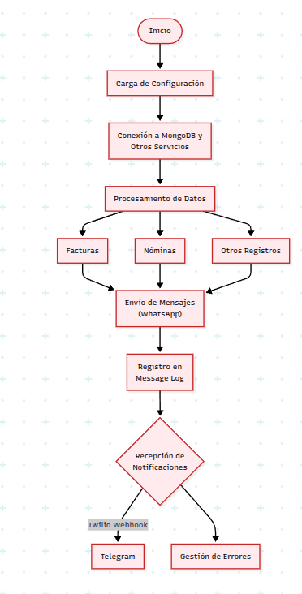

# Documentación para Cliente: Funcionamiento de la Aplicación

Esta documentación está diseñada para explicar de forma clara y sencilla el funcionamiento de la aplicación, sin entrar en detalles técnicos. A continuación se describe el papel de los principales componentes del sistema:

## 1. Configuración del Sistema (archivo: enviroments.js)

- **¿Qué es?** Este componente contiene todas las configuraciones necesarias para que la aplicación funcione correctamente, como claves secretas, parámetros de conexión y otros ajustes esenciales.
- **Función principal:** Garantiza que la aplicación se conecte a los servicios externos (como bases de datos y proveedores de mensajería) y defina la URL base de los servicios que se ofrecen.

## 2. Registro y Seguimiento de Mensajes (archivo: messageLog.js)

- **¿Qué es?** Es un registro que guarda cada mensaje que se envía desde la aplicación, ya sea una notificación, factura o aviso de nómina.
- **Función principal:** Permite saber si un mensaje se envió correctamente, falló o está pendiente, y almacena detalles importantes como el destinatario, fecha de envío, y en caso de error, el motivo.
- **Seguridad:** Utiliza procesos de cifrado para proteger la información sensible de los mensajes.

## 3. Procesamiento de Facturas (archivo: processInvoicesTask.js)

- **¿Qué es?** Aunque no se muestra el contenido completo, esta tarea se encarga de recopilar y procesar la información de las facturas de forma automática.
- **Función principal:** Organiza, valida y envía las facturas a través de los canales configurados, garantizando que la información se maneje de manera correcta y completa.

## 4. Procesamiento de Nóminas (archivo: processPayRollsTask.js)

- **¿Qué es?** Es la tarea encargada de gestionar la información relacionada con las nóminas (liquidaciones de pago).
- **Función principal:** Verifica que los períodos de nómina sean completos y correctos, se encarga de obtener información de usuarios y empleados, y registra el resultado final de cada envío.
- **Reintentos:** En caso de encontrar problemas, se reintenta el proceso para asegurar que la nómina se procese correctamente.

## 5. Gestión de Mensajes en Lotes (archivo: redis-messages.js)

- **¿Qué es?** Este servicio administra la cola de mensajes que se deben enviar por WhatsApp.
- **Función principal:** Agrupa y envía los mensajes en lotes, introduciendo pausas entre ellos para evitar la saturación o que se consideren como spam.
- **Seguimiento:** Después de cada envío, actualiza el estado del mensaje (éxito o fallo) en el registro de mensajes.

## 6. Gestión de Eventos y Notificaciones (archivo: twilioWebhookController.js)

- **¿Qué es?** Es el controlador que recibe las notificaciones de los servicios de mensajería (como Twilio) cuando se produce un evento, por ejemplo, al recibir una respuesta o confirmación de envío.
- **Función principal:** Procesa la información recibida y genera notificaciones automáticas hacia otros canales, como Telegram o nuevamente vía WhatsApp, para mantener informado al equipo o usuario final.

## Paso a Paso: Instalación y Puesta en Marcha

1. **Clonación del Repositorio:**
   - Abre una terminal y usa el comando:
     ```bash
     git clone https://github.com/gescuidoplus-collab/Backend-SMS
     ```
   - Navega al directorio del proyecto:
     ```bash
     cd BackendSMS
     ```

2. **Instalación de Dependencias:**
   - Ejecuta el comando para instalar las dependencias:
     ```bash
     npm install
     ```

3. **Configuración del Archivo de Entorno:**
   - Crea un archivo `.env` en la raíz del proyecto.
   - Copia el contenido del ejemplo provisto en la sección de [Variables de Entorno] y personalízalo con tus credenciales y parámetros.

4. **Ejecución en Desarrollo o Producción:**
   - Para iniciar en modo desarrollo (con recarga automática):
     ```bash
     npm run start:dev
     ```
   - Para iniciar en modo producción:
     ```bash
     npm run start:prod
     ```

5. **Verificación y Pruebas:**
   - Accede a `http://localhost:PORT/api/v1/healtcheck` (reemplaza PORT por el valor configurado) para confirmar que el servidor está funcionando.

---

## Diagrama de Funcionamiento

A continuación, se presenta el diagrama visual del flujo principal de la aplicación:




## Gestión de Errores

La aplicación incorpora mecanismos robustos para el manejo y registro de errores, asegurando que cualquier incidencia durante el flujo de trabajo sea documentada y notificada. A continuación se detalla su gestión:

- **Registro Detallado:**
  - Cada proceso (envío de mensaje, procesamiento de nómina o factura) registra en el sistema un estado que puede ser `success`, `failure` o `pending`.
  - En caso de error, se almacena el motivo en el registro del mensaje, permitiendo un rastreo post-mortem de la incidencia.

- **Notificación en Tiempo Real:**
  - Los errores críticos y fallos en el envío de mensajes son enviados a través de Telegram, notificando de inmediato al equipo responsable.
  - Los logs de error incluyen información básica del contexto (número de destino, tipo de mensaje, etc.) para facilitar la identificación del problema.

- **Reintentos Automáticos:**
  - Para procesos críticos como el procesamiento de nóminas o inicio de sesión en servicios externos, se implementan mecanismos de reintentos automáticos que intentan ejecutar la tarea nuevamente antes de confirmar el fallo.

- **Manejo Centralizado:**
  - Todos los módulos cuentan con bloques `try/catch` que capturan y manejan excepciones de manera local, dirigiendo los errores a un sistema centralizado que facilita la monitorización y la respuesta rápida.

---

## Flujo General de la Aplicación

1. **Inicio y Configuración:** Al iniciar, la aplicación carga todas las configuraciones necesarias (por ejemplo, credenciales y parámetros de red) definidas en el archivo de configuración.

2. **Procesamiento de Datos:** Dependiendo de la tarea, la aplicación procesa las facturas o nóminas, validando toda la información necesaria para asegurar su integridad.

3. **Envío de Mensajes:** Una vez procesados los datos, se crean mensajes que se envían a través de WhatsApp. Este envío se realiza en lotes para evitar problemas de spam.

4. **Registro y Seguimiento:** Cada mensaje enviado se registra en el sistema para poder consultarlo después y ver el estado de cada operación.

5. **Recepción de Notificaciones:** La aplicación escucha las notificaciones de Twilio. Cuando se reciben, se reenvían a otros servicios (como Telegram) para alertar sobre el estado o problemas en tiempo real.

## Conclusión

La aplicación está diseñada para automatizar el envío y seguimiento de notificaciones y documentos (facturas y nóminas) a través de servicios de mensajería. Gracias a su arquitectura modular, cada componente se encarga de una función específica, permitiendo un manejo eficiente y seguro de la información, garantizando que tanto los mensajes como los documentos se envíen correctamente y se registre cualquier incidencia para su monitoreo.

Esta documentación ofrece una visión general y no técnica del funcionamiento del sistema, para que cualquier usuario o cliente pueda entender el proceso sin necesitar conocimientos especializados en tecnología.
